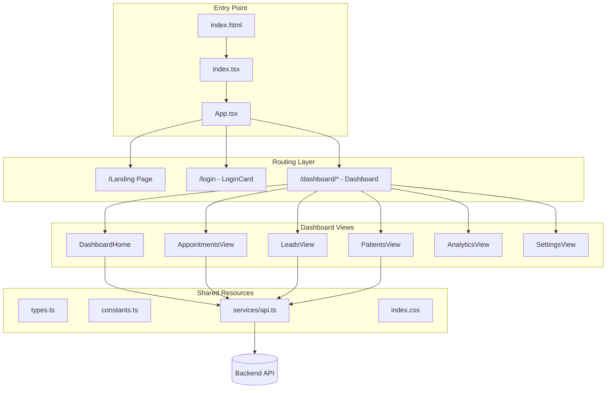
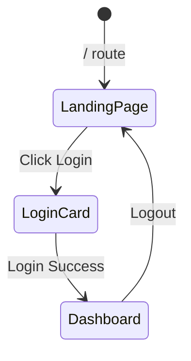
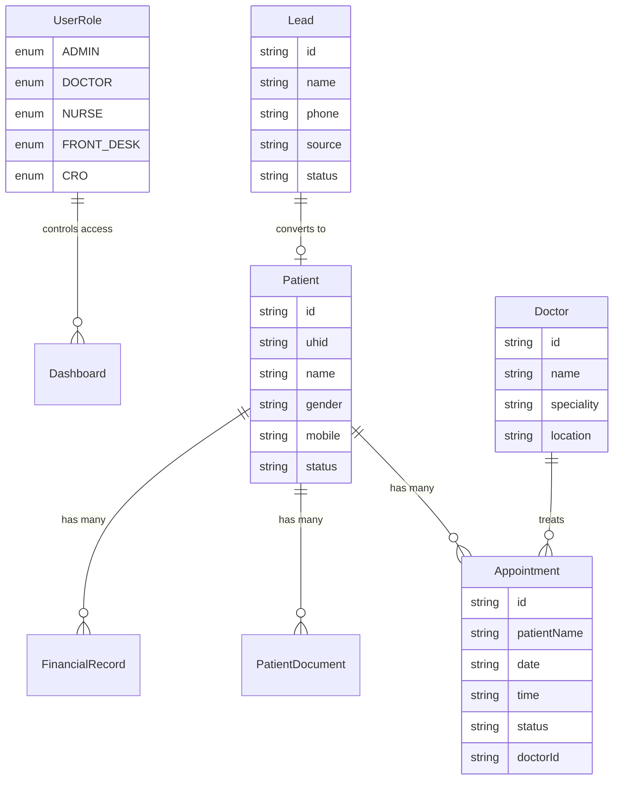
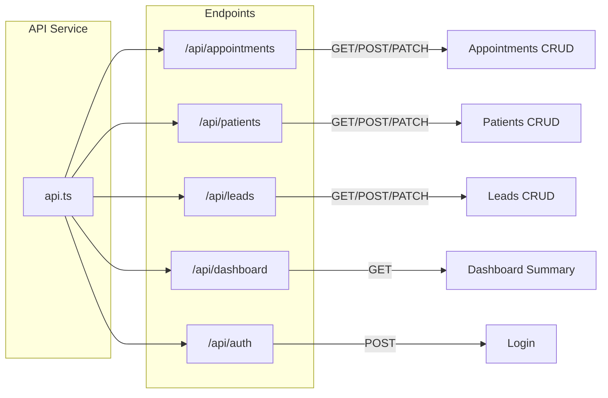
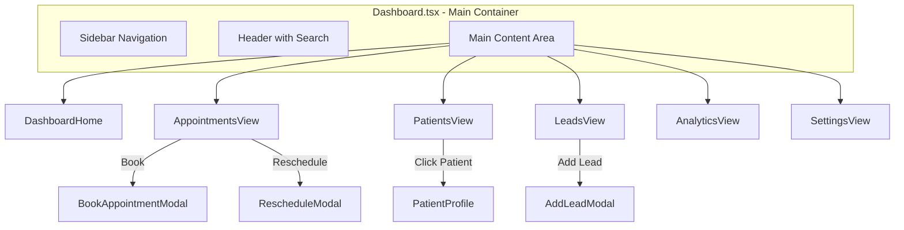
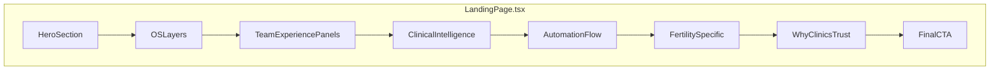
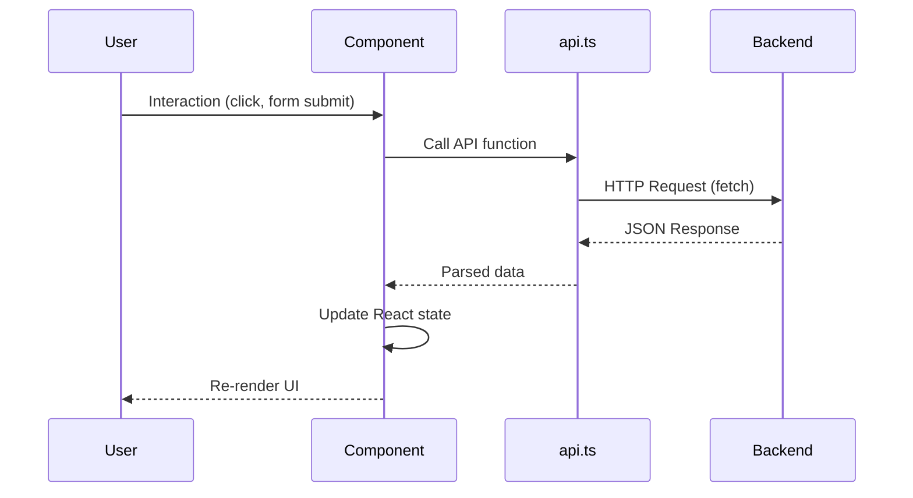
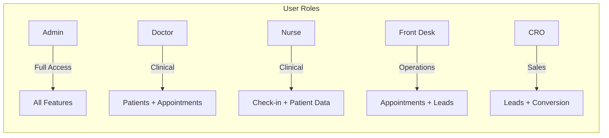

# JanmaSethu Clinical OS - Frontend Codebase Walkthrough

A comprehensive guide to the **Janmasethu Clinic CRM Frontend** - a React/TypeScript clinical management system for fertility clinics and hospitals.

---

## 🏗️ Project Architecture Overview



---

## 📁 File Structure Overview

| Category | Path | Purpose |
|----------|------|---------|
| **Entry** | `index.html`, `index.tsx` | App bootstrap & mounting |
| **Routing** | `App.tsx` | Route definitions & auth state |
| **Core Types** | `types.ts` | TypeScript interfaces for all entities |
| **Constants** | `constants.ts` | Doctor list, colors, static data |
| **API Layer** | `services/api.ts` | Backend communication wrapper |
| **Styling** | `index.css` | TailwindCSS + custom animations |
| **Components** | `components/` | 42 UI components |

---

## 🔑 Core Files Explained

### 1. [App.tsx](file:///c:/Users/GANESH/Downloads/clinics%20frontend/App.tsx) - Application Router

The root component that handles:
- **Routing** via React Router (`/`, `/login`, `/dashboard/*`)
- **Authentication state** using localStorage
- **User role management** (Admin, Doctor, Nurse, Front Desk, CRO)



---

### 2. [types.ts](file:///c:/Users/GANESH/Downloads/clinics%20frontend/types.ts) - Data Models

Defines all TypeScript interfaces used across the application:



---

### 3. [services/api.ts](file:///c:/Users/GANESH/Downloads/clinics%20frontend/services/api.ts) - API Service Layer

Centralized API wrapper with endpoints for all CRUD operations:



**Key Functions:**
| Function | Purpose |
|----------|---------|
| `getAppointments()` | Fetch appointments with filters |
| `createAppointment()` | Book new appointment |
| `updateAppointmentStatus()` | Check-in, cancel, complete |
| `getPatients()` / `searchPatients()` | Patient lookup |
| `createPatient()` | Register new patient |
| `getLeads()` / `updateLead()` | Lead management |
| `getCRODashboard()` | CRO-specific metrics |

---

## 🎨 Component Architecture

### Main Dashboard Structure



---

### Component Breakdown

#### 📊 Views (Main Content Panels)

| Component | Lines | Purpose |
|-----------|-------|---------|
| [Dashboard.tsx](file:///c:/Users/GANESH/Downloads/clinics%20frontend/components/Dashboard.tsx) | 553 | Main container, navigation, global handlers |
| [DashboardHome.tsx](file:///c:/Users/GANESH/Downloads/clinics%20frontend/components/DashboardHome.tsx) | ~200 | Overview widgets, stats, quick actions |
| [AppointmentsView.tsx](file:///c:/Users/GANESH/Downloads/clinics%20frontend/components/AppointmentsView.tsx) | 914 | Calendar/list views, booking, check-in flow |
| [PatientsView.tsx](file:///c:/Users/GANESH/Downloads/clinics%20frontend/components/PatientsView.tsx) | 274 | Patient list with search & filtering |
| [PatientProfile.tsx](file:///c:/Users/GANESH/Downloads/clinics%20frontend/components/PatientProfile.tsx) | 825 | Full patient details, appointments, documents |
| [LeadsView.tsx](file:///c:/Users/GANESH/Downloads/clinics%20frontend/components/LeadsView.tsx) | 399 | Lead tracking pipeline |
| [AnalyticsView.tsx](file:///c:/Users/GANESH/Downloads/clinics%20frontend/components/AnalyticsView.tsx) | 154 | Charts, conversion funnels |
| [SettingsView.tsx](file:///c:/Users/GANESH/Downloads/clinics%20frontend/components/SettingsView.tsx) | 305 | App configuration panels |

#### 🪟 Modals & Forms

| Component | Purpose |
|-----------|---------|
| [Modals.tsx](file:///c:/Users/GANESH/Downloads/clinics%20frontend/components/Modals.tsx) | RescheduleModal, Toast, CheckInModal, AddLeadModal |
| [AppointmentModals.tsx](file:///c:/Users/GANESH/Downloads/clinics%20frontend/components/AppointmentModals.tsx) | BookAppointmentModal, AppointmentDetailPopover |
| [LeadDetailsModal.tsx](file:///c:/Users/GANESH/Downloads/clinics%20frontend/components/LeadDetailsModal.tsx) | Lead detail view with actions |
| [PatientRegistration.tsx](file:///c:/Users/GANESH/Downloads/clinics%20frontend/components/PatientRegistration.tsx) | New patient registration form |

#### 🌐 Landing Page Sections



Located in `components/landing/`:
- `HeroSection.tsx` - Hero banner with CTA
- `OSLayers.tsx` - Feature layer visualization
- `TeamExperiencePanels.tsx` - Role-based benefit panels
- `FertilitySpecific.tsx` - IVF/Fertility features
- `WhyClinicsTrust.tsx` - Trust indicators
- `FinalCTA.tsx` - Call-to-action footer

---

## 🔄 Data Flow



---

## 🎯 User Roles & Access



---

## 🛠️ Tech Stack

| Technology | Version | Purpose |
|------------|---------|---------|
| **React** | 19.2.0 | UI Framework |
| **TypeScript** | 5.8.2 | Type Safety |
| **Vite** | 6.2.0 | Build Tool & Dev Server |
| **React Router** | 7.10.1 | Client-side Routing |
| **Framer Motion** | 12.23.25 | Animations |
| **Lucide React** | 0.554.0 | Icon Library |
| **TailwindCSS** | (via CDN) | Utility-first Styling |

---

## 📦 Key Configuration Files

| File | Purpose |
|------|---------|
| [package.json](file:///c:/Users/GANESH/Downloads/clinics%20frontend/package.json) | Dependencies & scripts |
| [vite.config.ts](file:///c:/Users/GANESH/Downloads/clinics%20frontend/vite.config.ts) | Vite build configuration |
| [tsconfig.json](file:///c:/Users/GANESH/Downloads/clinics%20frontend/tsconfig.json) | TypeScript compiler options |
| [index.css](file:///c:/Users/GANESH/Downloads/clinics%20frontend/index.css) | Global styles & animations |

---

## 🚀 Quick Start Commands

```bash
# Install dependencies
npm install

# Start development server
npm run dev

# Build for production
npm run build

# Preview production build
npm run preview
```

---

## 📈 Feature Summary

| Module | Features |
|--------|----------|
| **Appointments** | Calendar view, list view, book/reschedule/cancel, check-in flow |
| **Patients** | Registration, UHID generation, full profile, documents, clinical notes |
| **Leads** | Pipeline management, conversion tracking, CRO dashboard |
| **Analytics** | Conversion funnels, staff performance, lead sources |
| **Settings** | User management, integrations, templates |
